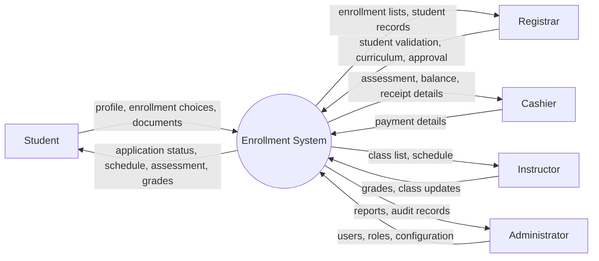
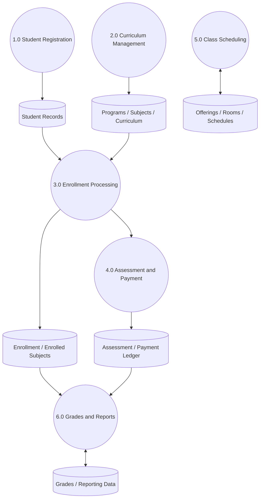

# Data Flow Diagram

## Context diagram (Level 0)

```mermaid
flowchart LR
  S[Student] -->|profile, enrollment choices, documents| SYS((Enrollment System))
  SYS -->|application status, schedule, assessment, grades| S
  R[Registrar] -->|student validation, curriculum, approval| SYS
  SYS -->|enrollment lists, student records| R
  C[Cashier] -->|payment details| SYS
  SYS -->|assessment, balance, receipt details| C
  I[Instructor] -->|grades, class updates| SYS
  SYS -->|class list, schedule| I
  A[Administrator] -->|users, roles, configuration| SYS
  SYS -->|reports, audit records| A
```

## Level 1 processes

```mermaid
flowchart TB
  P1((1.0 Student Registration)) --> D1[(Student Records)]
  P2((2.0 Curriculum Management)) --> D2[(Programs / Subjects / Curriculum)]
  P3((3.0 Enrollment Processing)) --> D3[(Enrollment / Enrolled Subjects)]
  D1 --> P3
  D2 --> P3
  P3 --> P4((4.0 Assessment and Payment))
  P4 --> D4[(Assessment / Payment Ledger)]
  P5((5.0 Class Scheduling)) <--> D5[(Offerings / Rooms / Schedules)]
  P6((6.0 Grades and Reports)) <--> D6[(Grades / Reporting Data)]
  D3 --> P6
  D4 --> P6
```
