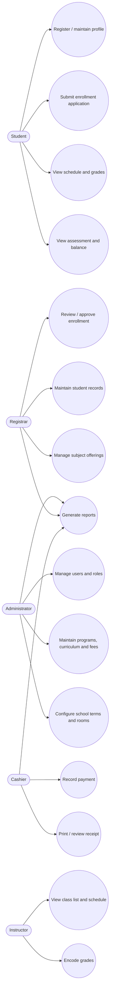

# Use Case Diagram

```mermaid
flowchart LR
  Student([Student]) --> UC1((Register / maintain profile))
  Student --> UC2((Submit enrollment application))
  Student --> UC3((View schedule and grades))
  Student --> UC4((View assessment and balance))
  Registrar([Registrar]) --> UC5((Review / approve enrollment))
  Registrar --> UC6((Maintain student records))
  Registrar --> UC7((Manage subject offerings))
  Admin([Administrator]) --> UC8((Manage users and roles))
  Admin --> UC9((Maintain programs, curriculum and fees))
  Admin --> UC10((Configure school terms and rooms))
  Cashier([Cashier]) --> UC11((Record payment))
  Cashier --> UC12((Print / review receipt))
  Instructor([Instructor]) --> UC13((View class list and schedule))
  Instructor --> UC14((Encode grades))
  Admin --> UC15((Generate reports))
  Registrar --> UC15
  Cashier --> UC15
```

Actors: Student, Registrar, Cashier, Instructor, Administrator.
